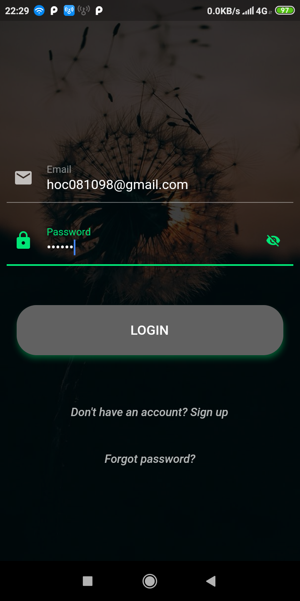
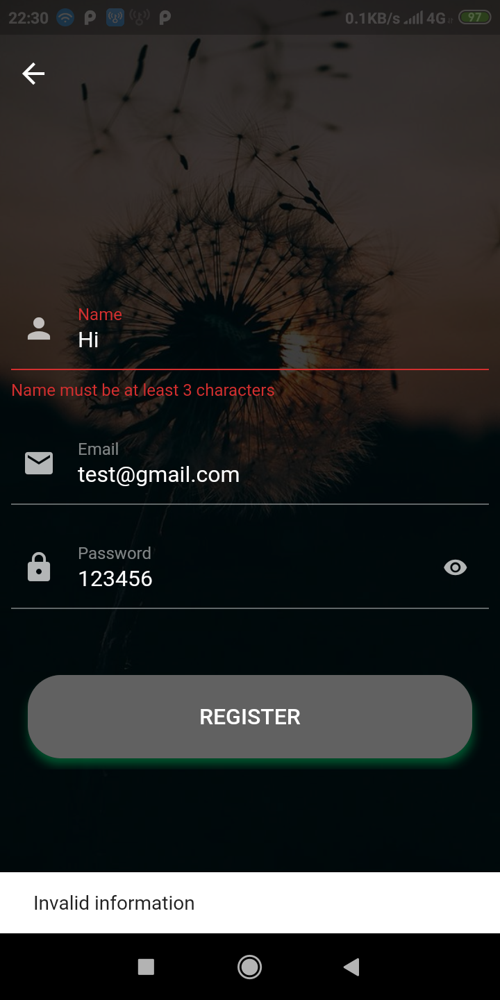
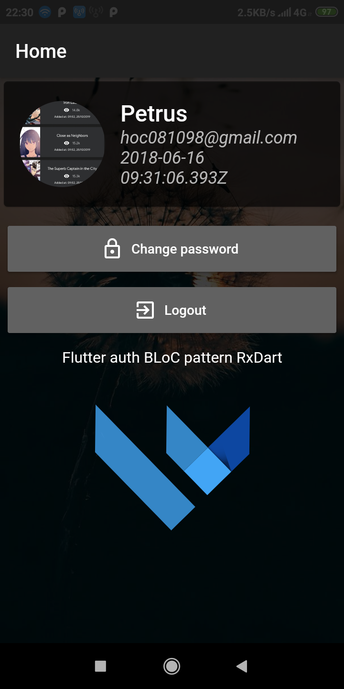
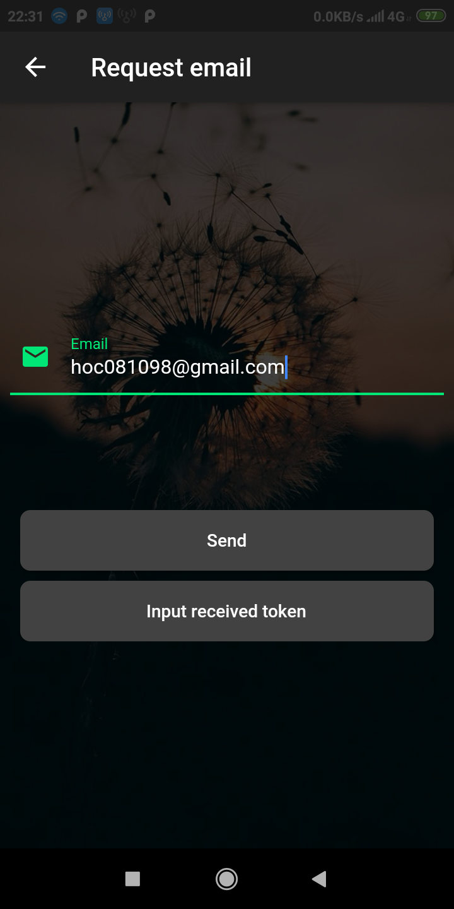

# node_auth

 - ❄️ ❄️ `BLoC pattern` `rxdart` `stream` 🐋 🐋 Simple auth app flutter, server node.js, BLoC pattern, RxDart
 - Functionalities: `LOGIN`, `REGISTER`, `CHANGE PASSWORD`, `CHANGE AVATAR`, `FORGOT PASSWORD` 🌀 🌀

## Video demo:

[Youtube](https://youtu.be/OvsDKfy0aOs)

## Download apk [here](https://github.com/hoc081098/hoc081098.github.io/blob/master/node_auth/app-release.apk)

## Screenshots

|  |  |  |
| :---:  | :---:  | :---:  |
|  |  |  
|  |  |  
